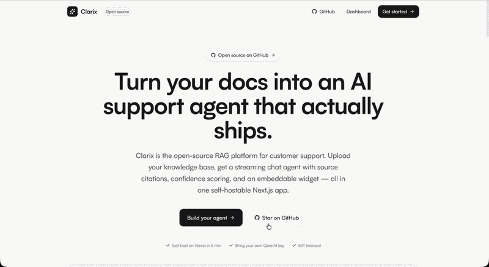

<div align="center">

# Clarix

**The open-source AI customer support platform you can self-host in minutes.**

Upload your docs. Get a production-ready AI support agent with source
citations, confidence scoring, and an embeddable chat widget — all in
one Next.js app.

[](https://clarix-rouge.vercel.app)
[](https://clarix-rouge.vercel.app)
[](./LICENSE)

[](https://nextjs.org)
[](https://react.dev)
[](https://www.typescriptlang.org)
[](https://tailwindcss.com)
[](https://openai.com)
[](https://sdk.vercel.ai)

[**Live demo**](https://clarix-rouge.vercel.app) · [**Self-host in 5 minutes**](#getting-started)

</div> 

<p align="center">
  
  <br/>
  <em>Demo — persona selection → session</em>
</p>

---

> Most "AI chatbot" demos are Jupyter notebooks. Toy projects. No UI, no
> persistence, no real RAG. Clarix is the opposite — a deployable
> multi-tenant SaaS that any team can stand up on Monday and have
> answering customer questions by Tuesday.

<br />

<!-- TODO: replace with hero screenshot of dashboard + chat widget side by side -->
<!--  -->

## Why Clarix

Building an AI support agent that actually works in production means
solving a long list of unsexy problems: parsing messy documents,
chunking them sensibly, generating embeddings, running vector search,
streaming a response, citing sources, capturing feedback, detecting gaps,
and embedding it all on a customer's site without breaking their CSP.

Clarix solves every one of these out of the box. It's the entire
RAG-powered support pipeline — from ingestion to embeddable widget —
shipped as a single Next.js app you can deploy to Vercel in five minutes.

<br />

## What's in the box

- **Knowledge base** — Upload files, paste URLs, or write Markdown.
  Clarix parses, chunks, and embeds everything with
  `text-embedding-3-small`, then serves retrieval-augmented answers via
  GPT-4o.
- **Guided interview** — A Q&A composer that turns raw notes into
  polished Markdown KB entries, so non-technical teammates can
  contribute content without touching the editor.
- **Per-project OpenAI keys** — Bring your own key. Stored server-side
  per project, never sent back to the browser.
- **Streaming chat with citations** — Real Vercel AI SDK streaming with
  source citations, quick-reply suggestions, and conversation
  persistence.
- **Confidence scoring** — Every answer gets a 0–1 confidence score
  derived from retrieval relevance, surfaced in the UI and analytics.
- **Knowledge gap detection** — Tracks the questions your agent struggles
  with so you know exactly which docs to add next.
- **Embeddable widget** — A single script tag drops the full chat
  experience on any website. Tested on Next.js, React/Vite, WordPress,
  Shopify, Webflow, Framer, and plain HTML.
- **Analytics dashboard** — Conversation volume, resolution rate,
  feedback capture, and rolling OpenAI token usage per project.
- **One-click demo content** — Hit "Load sample content" on a fresh KB
  to populate it with a fictional B2B SaaS (Acme Cloud) so you can try
  chat, citations, and analytics in 30 seconds.
- **Command palette** — `⌘K` / `Ctrl+K` anywhere in the dashboard pops
  the topbar search and jumps to any page with arrow keys + enter.
- **Sand design system** — Warm, minimal UI built with Tailwind CSS v4
  and Framer Motion. Dark on light, no gradients, no gimmicks.

<br />

## Screenshots

<!--
  Replace these placeholders with real screenshots after taking them:
  - dashboard-overview.png  — main dashboard with stat tiles
  - knowledge-base.png      — KB explorer with categories sidebar
  - chat-citations.png      — chat answer with source citations expanded
  - analytics.png           — analytics dashboard with conversation chart
  - widget-embed.png        — the embed code snippet on a clean background
-->

<br />

## Tech stack

| Layer         | Choice                                            |
| ------------- | ------------------------------------------------- |
| Framework     | Next.js 16 (App Router) + React 19                |
| Language      | TypeScript                                        |
| Styling       | Tailwind CSS v4 + custom sand palette             |
| Animation     | Framer Motion                                     |
| AI SDK        | Vercel AI SDK v6 (`ai`, `@ai-sdk/openai`)         |
| LLM           | OpenAI GPT-4o                                     |
| Embeddings    | OpenAI `text-embedding-3-small`                   |
| Vector search | In-memory cosine similarity                       |
| Persistence   | Upstash Redis (optional) + in-memory fallback     |

<br />

## Getting started

### 1. Clone and install

```bash
git clone https://github.com/Dawood-Hamayun/clarix.git
cd clarix
npm install
```

### 2. Set your environment

```bash
cp .env.example .env.local
```

None of the variables are required for local development — Clarix will
happily run with an in-memory store and let you paste your OpenAI key
through the onboarding UI. But you'll probably want these set in
production:

| Variable                                              | Purpose                                                                                                          |
| ----------------------------------------------------- | ---------------------------------------------------------------------------------------------------------------- |
| `OPENAI_API_KEY`                                      | Optional fallback key when a project has none saved yet. Users can still paste their own from Settings.          |
| `KV_REST_API_URL` + `KV_REST_API_TOKEN`               | Upstash Redis credentials so projects, conversations, and embeddings survive server restarts.                    |
| `UPSTASH_REDIS_REST_URL` + `UPSTASH_REDIS_REST_TOKEN` | Aliases accepted as a fallback for the same Upstash database.                                                    |

### 3. Run it

```bash
npm run dev
```

Open [http://localhost:3000](http://localhost:3000) and walk through the
5-step onboarding. You'll be asked to paste an OpenAI API key —
[grab one here](https://platform.openai.com/api-keys) — and then you're
off.

### 4. Try the sample content (30 seconds)

Once you're in the dashboard, head to **Knowledge Base** and click
**Load sample content**. Clarix will populate your workspace with 8
markdown docs from a fictional B2B SaaS called Acme Cloud — covering
pricing, FAQ, how-tos, privacy, and more. Then open the **Playground**
and ask things like:

- _"How do I cancel my subscription?"_
- _"What's your refund policy?"_
- _"Are you SOC 2 compliant?"_
- _"How do I reset my password if I use SSO?"_

Watch the agent stream a grounded answer with inline source citations
and a confidence score in the corner.

<br />

## Deploying to Vercel

1. Fork this repo and push it to your own GitHub account.
2. Import the project on [vercel.com/new](https://vercel.com/new).
3. (Optional) Add an Upstash Redis integration from the Vercel
   marketplace. It auto-fills `KV_REST_API_URL` and `KV_REST_API_TOKEN`.
4. (Optional) Set a fallback `OPENAI_API_KEY` in Project Settings →
   Environment Variables.
5. Deploy. Visit the onboarding URL and paste your OpenAI key.

<br />

## Architecture at a glance

```
src/
├── app/
│   ├── api/                  # Route handlers (chat, knowledge, project, demo, etc.)
│   ├── dashboard/            # Authenticated dashboard pages
│   ├── onboarding/           # 5-step getting-started flow
│   └── embed/                # Iframe target loaded by /public/widget.js
├── components/               # UI primitives + feature components
├── lib/
│   ├── ai/                   # OpenAI client, embeddings, RAG, prompts
│   ├── knowledge/            # Parser, chunker, scraper, processor pipeline
│   └── db/                   # Store, vector store, types, demo data
└── styles/
```

### The RAG pipeline

**Ingestion** — File / URL / text → parser → recursive chunker
(≈500 tokens, 100 overlap) → OpenAI embeddings → in-memory vector store.

**Retrieval** — User query → embedding → cosine top-k → augmented system
prompt with source citations → streaming GPT-4o response.

All OpenAI calls resolve the project's key via `lib/ai/client.ts` —
`getOpenAIProvider(projectId)` for chat, `getOpenAIClient(projectId)`
for embeddings. If a project has no key and no `OPENAI_API_KEY` is set
in env, the call throws a `MissingOpenAIKeyError` and the API route
returns a clean `400 { code: "missing_openai_key" }` that the UI can
catch.

<br />

## Case study: a production AI support agent in one repo

**The challenge.** Most AI chatbot demos floating around are Jupyter
notebooks: scripts that prove a model can answer questions in a
controlled setting, but ship none of the surrounding infrastructure
that turns a model into a product. Real businesses need persistence,
multi-tenancy, an admin UI, an embeddable surface, and analytics.

**What's here.** Clarix is the entire stack: ingestion pipeline, vector
store with optional Redis persistence, retrieval-augmented streaming
chat, source citations, confidence scoring, knowledge-gap detection,
embeddable widget, admin dashboard, multi-tenant per-project API keys,
and a one-click demo seeder.

**The numbers.**

- ~13,500 lines of TypeScript across ~75 files
- Built solo using AI-accelerated development
- Zero vendor lock-in — runs against in-memory or Upstash Redis
- MIT licensed, deployed live on Vercel

**Stack.** Next.js 16, React 19, TypeScript, Tailwind v4, Framer Motion,
Vercel AI SDK v6, OpenAI GPT-4o, OpenAI `text-embedding-3-small`,
Upstash Redis (optional).

**What this proves I can build for you.**

- Production RAG systems that work against real, messy documents
- Multi-tenant SaaS architecture with per-tenant secrets
- Real-time streaming UIs with proper error handling and graceful
  fallbacks for missing keys
- Embeddable widgets with CORS, CSP, and security done right
- Admin dashboards with actual analytics, not vanity metrics
- End-to-end products from idea to deployed Vercel URL

[**Live demo**](https://clarix-rouge.vercel.app) · [**See more work**](https://mydesigndude.com)

<br />

## Scripts

| Command         | What it does                           |
| --------------- | -------------------------------------- |
| `npm run dev`   | Start the dev server on port 3000      |
| `npm run build` | Production build                       |
| `npm run start` | Start the production server            |
| `npm run lint`  | ESLint with the Next.js config         |

<br />

## Contributing

PRs welcome. If you're adding a feature, please keep the knowledge-base
experience the hero of the product — it should feel effortless.

1. Fork the repo and create a feature branch.
2. Run `npm run lint` and `npm run build` before opening a PR.
3. Describe the user-facing change in the PR body. Screenshots or short
   screen recordings go a long way.

<br />

## License

MIT. See [LICENSE](./LICENSE).
